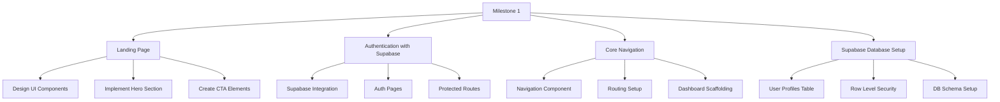
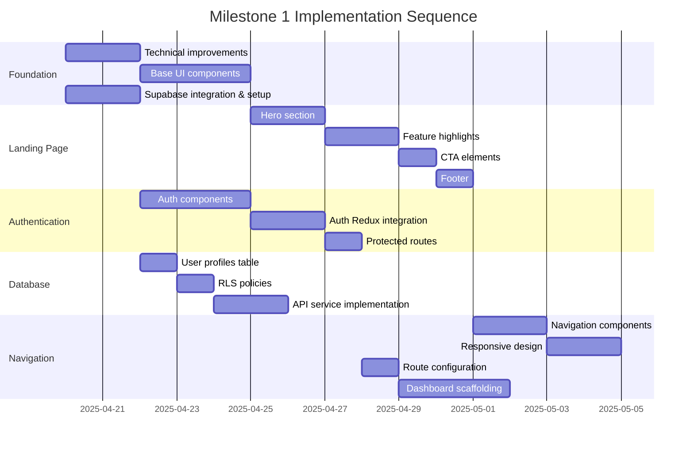

# Revised Plan for Milestone 1: Landing Page, Authentication, and Core Navigation

Based on the comprehensive review of the Memory Bank and the decision to use Supabase for authentication and database needs, I've revised our detailed plan for implementing Milestone 1 of TarotLyfe.

## Milestone 1 Overview

## 1. Landing Page Implementation

### Key Components to Create:
- Hero section with captivating tarot imagery and brand introduction
- Feature highlights section (AI-powered readings, journaling, personal growth)
- Call-to-action buttons for sign up/login
- Testimonials or benefits section
- Footer with necessary links

### Implementation Plan:
1. **Create Landing Page Component:**
   - File: `src/features/landing/LandingPage.jsx`
   - Structured with semantic HTML (header, sections, footer)
   - Responsive design with mobile-first approach using TailwindCSS

2. **Develop Hero Section:**
   - Eye-catching hero with tarot imagery
   - Clear value proposition statement
   - Primary CTA button for sign-up
   
3. **Implement Feature Highlights:**
   - Component: `src/features/landing/components/FeatureHighlight.jsx`
   - Showcase key product differentiators
   - Visual icons/illustrations for each feature

4. **Create Call-to-Action Components:**
   - Component: `src/components/ui/CTAButton.jsx`
   - Styled prominently with TailwindCSS
   - Clear action text with hover/focus states

5. **Add Footer:**
   - Component: `src/components/shared/Footer.jsx`
   - Links to important pages (About, Privacy, Terms)
   - Social media links if applicable

## 2. Authentication Implementation with Supabase

### Authentication Components:
- Sign Up Form
- Login Form
- Password Reset Flow
- Auth Layout with shared styling

### Implementation Plan:
1. **Supabase Integration:**
   - Install Supabase client: `npm install @supabase/supabase-js`
   - Create `src/services/supabase.js` for client initialization
   - Set up environment variables:
     - `VITE_SUPABASE_URL`
     - `VITE_SUPABASE_ANON_KEY`
   
2. **Auth Features Implementation:**
   - Create `src/features/authentication/SignUp.jsx` with Supabase email signup
   - Create `src/features/authentication/Login.jsx` with Supabase email login
   - Create `src/features/authentication/PasswordReset.jsx` using Supabase password reset flow
   - Create shared `src/features/authentication/AuthLayout.jsx`
   - Implement social login options if desired (Google, GitHub, etc.)

3. **Redux Integration:**
   - Update existing auth slice (`src/features/authentication/authSlice.js`)
   - Create actions for Supabase login, logout, session management
   - Implement session persistence with `supabase.auth.getSession()`
   - Add listener for auth state changes with `supabase.auth.onAuthStateChange()`

4. **Protected Routes:**
   - Component: `src/components/shared/ProtectedRoute.jsx`
   - Implement route protection based on Supabase auth state
   - Add redirect logic for unauthenticated users

## 3. Supabase Database Setup

### Database Configuration:
1. **Create User Profiles Table:**
   - SQL: Create `profiles` table linked to Supabase Auth `users`
   - Fields: id (references auth.users), display_name, avatar_url, preferences, created_at, updated_at
   - Set up triggers to create profile on user signup

2. **Implement Row Level Security (RLS):**
   - Create policies for `profiles` table:
     - Users can read/update only their own profiles
     - Admin roles for future management features

3. **Create Database Schema for Future Milestone Features:**
   - Plan tables for tarot readings and journal entries
   - Document relationships between users, readings, and journal entries
   - Establish foundational schema structure

4. **Supabase API Service:**
   - Create `src/services/supabaseService.js` with functions for:
     - User profile management
     - Data fetching/updating
     - Error handling for database operations

## 4. Core Navigation

### Navigation Components:
- Main Navigation Bar
- Mobile Navigation Menu
- User Menu Dropdown

### Implementation Plan:
1. **Create Navigation Components:**
   - Component: `src/components/shared/Navigation.jsx`
   - Component: `src/components/shared/MobileNav.jsx`
   - Component: `src/components/shared/UserMenu.jsx` (with Supabase auth status)

2. **Implement Responsive Design:**
   - Desktop navigation with horizontal menu
   - Mobile navigation with hamburger menu
   - Smooth transitions between states

3. **Route Configuration:**
   - Update `src/routes/index.jsx` with all routes
   - Implement route protection using Supabase auth state
   - Set up route transitions

4. **Dashboard Scaffolding:**
   - Create basic dashboard at `src/features/dashboard/Dashboard.jsx`
   - Add placeholder widgets for future milestones
   - Implement navigation between dashboard sections
   - Create initial data fetching from Supabase

## 5. Technical Improvements

As part of Milestone 1, we'll also address these technical improvements:

1. **SCSS Refactoring:**
   - Update imports to use @use and @forward syntax
   - Replace deprecated color functions
   - Organize SCSS files to match component structure

2. **Component Library Enhancement:**
   - Create/improve base UI components:
     - Buttons (primary, secondary, tertiary)
     - Form inputs with validation
     - Cards and containers
     - Typography components

3. **Error Handling:**
   - Create global error boundary
   - Implement consistent error handling for Supabase operations
   - Add user-friendly error messages

4. **Supabase-Specific Utilities:**
   - Create helper functions for common Supabase operations
   - Implement client-side data validation
   - Create hooks for Supabase realtime subscriptions (for future use)

## Implementation Sequence

## Detailed Tasks Breakdown

### Week 1: Foundation & Supabase Setup
- Set up base UI components
- Refactor SCSS to address deprecation warnings
- Install and configure Supabase client
- Set up environment variables for Supabase
- Create user profiles table in Supabase
- Implement RLS policies for data security
- Create Supabase service layer

### Week 2: Landing Page & Authentication
- Implement landing page hero section
- Create feature highlights section
- Develop CTA components
- Add footer component
- Create authentication components with Supabase
- Integrate Supabase auth with Redux
- Implement protected routes

### Week 3: Navigation & Dashboard
- Create navigation components
- Set up responsive navigation design
- Develop route configuration
- Create dashboard scaffolding
- Integrate Supabase data fetching in dashboard

## Testing Strategy

For Milestone 1, we'll implement testing focusing on:
- Component rendering tests for UI components
- Authentication flow tests with Supabase
- Navigation flow tests
- Database access tests (read/write operations)
- Responsive design tests across breakpoints

## Success Criteria

Milestone 1 will be considered complete when:
1. Users can access an engaging landing page
2. Users can register, log in, and reset passwords using Supabase authentication
3. User profiles are created in Supabase upon registration
4. Authenticated users can access protected routes
5. The navigation is responsive and works across devices
6. The basic dashboard scaffolding is in place for future development
7. Proper data security is implemented with Row Level Security

## Supabase-Specific Benefits

By using Supabase for authentication and database:
1. **Simplified Backend**: Reduced need for custom backend code
2. **Real-time Capabilities**: Foundation for real-time features in future milestones
3. **PostgreSQL Power**: Full SQL database capabilities
4. **Security**: Built-in RLS for data protection
5. **Scalability**: Easy to scale as the application grows
6. **Auth Simplicity**: Pre-built auth flows reduce development time

This revised plan provides a structured approach to implementing Milestone 1 with Supabase as the authentication and database provider, creating a solid foundation for the TarotLyfe application.
