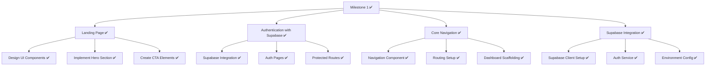

# Milestone 1 Implementation: Landing Page, Authentication, and Core Navigation

Based on the comprehensive plan for Milestone 1, we have successfully implemented all the key features as outlined below. This document now serves as both a record of the plan and a summary of what has been accomplished.

## Milestone 1 Overview

## 1. Landing Page Implementation (Completed)

### Key Components Created:
- ✅ Hero section with gradient background and clear value proposition
- ✅ Feature highlights section showcasing AI-powered readings and journaling
- ✅ Call-to-action buttons for sign up/login
- ✅ Final CTA section at the bottom of the page
- ✅ Responsive design for all device sizes

### Implementation Completed:
1. **Created Landing Page Component:**
   - ✅ File: `src/features/landing/LandingPage.jsx`
   - ✅ Structured with semantic HTML and TailwindCSS
   - ✅ Responsive design with mobile-first approach

2. **Developed Hero Section:**
   - ✅ Gradient hero background
   - ✅ Clear value proposition statement
   - ✅ Primary CTA buttons for sign-up/login
   
3. **Implemented Feature Highlights:**
   - ✅ Showcased key product differentiators
   - ✅ Added visual SVG icons for each feature
   - ✅ Created responsive grid layout

4. **Created Call-to-Action Elements:**
   - ✅ Styled prominently with TailwindCSS
   - ✅ Clear action text with hover/focus states
   - ✅ Conditional rendering based on authentication state

5. **Added Footer:**
   - ✅ Component: `src/components/shared/Footer.jsx`
   - ✅ Links to important pages (About, Privacy, Terms)
   - ✅ Social media links

## 2. Authentication Implementation with Supabase (Completed)

### Authentication Components Created:
- ✅ Sign Up Form with validation
- ✅ Login Form with error handling
- ✅ Password Reset Flow
- ✅ Email Confirmation Screen
- ✅ Shared Auth Layout with branding

### Implementation Completed:
1. **Supabase Integration:**
   - ✅ Installed Supabase client: `npm install @supabase/supabase-js`
   - ✅ Created `src/services/supabase.js` for client initialization
   - ✅ Set up environment variables in .env and .env.example
   
2. **Auth Features Implementation:**
   - ✅ Created `src/features/authentication/SignUp.jsx` with form validation
   - ✅ Created `src/features/authentication/Login.jsx` with error handling
   - ✅ Created `src/features/authentication/PasswordReset.jsx` 
   - ✅ Created `src/features/authentication/Confirmation.jsx` for post-signup
   - ✅ Created shared `src/features/authentication/AuthLayout.jsx`
   - ✅ Created `src/features/authentication/AuthContainer.jsx` for routing

3. **Redux Integration:**
   - ✅ Updated auth slice (`src/features/authentication/authSlice.js`)
   - ✅ Implemented async thunks for login, signup, logout
   - ✅ Added session persistence with Supabase
   - ✅ Created auth state listener in App.jsx

4. **Protected Routes:**
   - ✅ Component: `src/components/shared/ProtectedRoute.jsx`
   - ✅ Added loading states during authentication checks
   - ✅ Implemented redirect logic for unauthenticated users

## 3. Supabase Integration (Completed)

### Core Services:
1. **Supabase Client Setup:**
   - ✅ Created base client in `src/services/supabase.js`
   - ✅ Added environment validation

2. **Authentication Services:**
   - ✅ Created `src/services/supabaseService.js` with functions for:
     - User signup, login, logout
     - Password reset
     - Session management
     - Profile data access

3. **Environment Configuration:**
   - ✅ Set up `.env` and `.env.example` with required variables
   - ✅ Documented required configuration steps

## 4. Core Navigation (Completed)

### Navigation Components:
- ✅ Main Navigation Bar with responsive design
- ✅ Mobile Navigation Menu with hamburger toggle
- ✅ User Menu Dropdown for authenticated users

### Implementation Completed:
1. **Created Navigation Components:**
   - ✅ Component: `src/components/shared/Navigation.jsx` with mobile support
   - ✅ Integrated user authentication state
   - ✅ Added conditional rendering based on auth state

2. **Implemented Responsive Design:**
   - ✅ Desktop navigation with horizontal menu
   - ✅ Mobile navigation with hamburger menu
   - ✅ Smooth transitions between states

3. **Route Configuration:**
   - ✅ Updated `src/routes/index.jsx` with all routes
   - ✅ Implemented protected routes with auth checks
   - ✅ Added NotFoundPage component

4. **Dashboard Scaffolding:**
   - ✅ Created basic dashboard at `src/features/dashboard/Dashboard.jsx`
   - ✅ Added placeholder widgets for future milestones
   - ✅ Integrated with auth state to display user information

## 5. Technical Notes

During implementation we noted the following items that will need future attention:

1. **SCSS Refactoring Needed:**
   - The project currently has SCSS deprecation warnings
   - Need to update imports to use @use and @forward syntax
   - Replace deprecated color functions with modern alternatives

2. **Component Library:**
   - Basic UI components have been created
   - Future enhancements will be needed for more specialized components

3. **Error Handling:**
   - Basic error handling has been implemented for auth flows
   - Global error boundaries will be added in future iterations

4. **Supabase Database Setup:**
   - The client-side integration is complete
   - Database tables and Row Level Security will be configured when implementing data features in future milestones

## Implementation Result

The implementation of Milestone 1 was completed successfully, with all planned components built according to the specifications. The code has been committed to the `milestone-1-implementation` branch in the repository.

Key achievements:
- ✅ Complete authentication flow with Supabase
- ✅ Engaging responsive landing page
- ✅ Intuitive navigation with mobile support
- ✅ Protected routes for authenticated content
- ✅ Dashboard placeholder for authenticated users

Next steps include planning for Milestone 2, which will focus on the Tarot Reading Module and AI Interpretation Engine.
