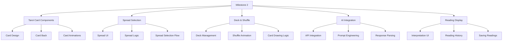

# Milestone 2 Implementation Plan: Tarot Reading Module and AI Interpretation Engine

This document outlines the comprehensive plan for implementing Milestone 2 of TarotLyfe, focusing on the core functionality of tarot card readings and AI interpretations.

## Milestone 2 Overview



## 1. Tarot Card Components & Deck Implementation

### Key Components to Create:
- Enhanced `TarotCard` component (build upon the existing one in `src/components/ui/TarotCard.jsx`)
- `TarotDeck` component for managing the entire deck
- Card flip animations and interactive elements

### Implementation Details:

1. **Enhanced Tarot Card Component:**
   - File: `src/components/ui/TarotCard.jsx`
   - Features:
     - Front and back views with flip animation
     - Card details display (name, imagery, card number)
     - Card hover and selection states
     - Responsive design for various device sizes

2. **Tarot Deck Management:**
   - File: `src/features/tarotReading/TarotDeck.jsx`
   - Features:
     - Complete set of 78 tarot cards (22 Major Arcana, 56 Minor Arcana)
     - Card metadata (names, meanings, imagery)
     - Deck initialization and state management
     - Card selection and management

3. **Card Data Structure:**
   - File: `src/features/tarotReading/tarotData.js`
   - Content:
     - Full card definitions with names, descriptions, and meanings
     - Card imagery references
     - Upright and reversed meanings
     - Keywords and themes for each card

4. **Visual Assets:**
   - Leverage existing card SVGs in public/images
   - Create/source additional card designs as needed
   - Optimize images for web performance

## 2. Shuffle and Spread Selection Implementation

### Key Components to Create:
- `ShuffleAnimation` component for visual card shuffling
- `SpreadSelector` component for choosing reading types
- State management for shuffle and spread selection

### Implementation Details:

1. **Shuffle Animation Component:**
   - File: `src/features/tarotReading/ShuffleAnimation.jsx`
   - Features:
     - Visual animation of cards being shuffled
     - Interactive shuffle trigger (button or gesture)
     - Animation states (idle, shuffling, complete)
     - Options for shuffle speed and style

2. **Spread Selector Component:**
   - File: `src/features/tarotReading/SpreadSelector.jsx`
   - Features:
     - Multiple spread options:
       - Single Card (daily reading)
       - Three-Card Spread (past, present, future)
       - Celtic Cross (detailed 10-card reading)
     - Visual representation of each spread layout
     - Selection UI with descriptions
     - Responsive design for all devices

3. **Card Drawing Logic:**
   - File: `src/features/tarotReading/cardDrawingUtils.js`
   - Features:
     - Random card selection algorithms
     - Card reversal logic (upright/reversed)
     - Duplicate prevention
     - Spread position assignment

## 3. Tarot Reading Page Implementation

### Key Components to Create:
- `TarotReadingPage` as the main container for the reading experience
- Reading flow management
- User question/intent capture

### Implementation Details:

1. **Tarot Reading Page:**
   - File: `src/features/tarotReading/TarotReadingPage.jsx`
   - Features:
     - Step-by-step reading flow (intent → shuffle → spread → cards → interpretation)
     - Progress indicators
     - Navigation between steps
     - Overall reading experience management
     - Mobile and desktop layouts

2. **User Intent Component:**
   - File: `src/features/tarotReading/UserIntent.jsx`
   - Features:
     - Form for user to input their question or focus
     - Guidance text for formulating effective questions
     - Topic selection helpers (relationships, career, personal growth)
     - Input validation and submission

3. **Reading State Management:**
   - File: `src/features/tarotReading/tarotReadingSlice.js`
   - Features:
     - Redux slice for tarot reading state
     - Actions for each reading step
     - Selected cards and positions
     - Reading results and history
     - Async thunks for API interactions

## 4. AI Interpretation Integration

### Key Components to Create:
- AI service integration
- Interpretation formatting and display
- Error handling and fallbacks

### Implementation Details:

1. **AI Interpretation Service:**
   - File: `src/services/interpretationService.js`
   - Features:
     - API client for AI service
     - Prompt engineering and formatting
     - Response parsing and processing
     - Error handling and retries
     - Caching for common interpretations

2. **Interpretation Request Format:**
   ```javascript
   // Example request structure
   {
     userQuestion: "What should I focus on in my career right now?",
     spread: "three-card",
     cards: [
       { name: "The Emperor", position: "past", orientation: "upright" },
       { name: "Eight of Cups", position: "present", orientation: "reversed" },
       { name: "The Star", position: "future", orientation: "upright" }
     ]
   }
   ```

3. **API Contract:**
   - Endpoint: `/api/tarot/interpret` (placeholder until actual AI service is selected)
   - Request: 
     - User question/intent
     - Selected spread type
     - Card data (names, positions, orientations)
   - Response:
     - Overall reading summary
     - Card-specific interpretations
     - Theme identification
     - Guidance and insights
     - Timestamp and unique reading ID

4. **AI Provider Options:**
   - OpenAI GPT for text generation
   - Custom fine-tuned model for tarot-specific interpretation
   - Hugging Face model hosting
   - Anthropic Claude for potential nuanced interpretations
   (We'll need to finalize which AI provider to use based on requirements and budget)

## 5. Reading Results Display

### Key Components to Create:
- `ReadingInterpretation` component for displaying results
- Card layout visualization
- Interpretation text formatting

### Implementation Details:

1. **Reading Results Component:**
   - File: `src/features/tarotReading/ReadingInterpretation.jsx`
   - Features:
     - Visual display of selected cards in spread positions
     - Overall reading summary
     - Individual card interpretations
     - Thematic elements and guidance
     - Share or save reading options
     - Journal entry creation prompt

2. **Card Layout Visualization:**
   - File: `src/features/tarotReading/SpreadLayout.jsx`
   - Features:
     - Visual representation of cards in their spread positions
     - Position labels and meanings
     - Responsive layouts for different spreads
     - Interactive card selection for detailed view

3. **Save Reading Functionality:**
   - File: `src/features/tarotReading/saveReadingUtils.js`
   - Features:
     - Save reading to user's history
     - Generate unique reading ID
     - Store complete reading data
     - Link to journal entries (preparation for Milestone 3)

## 6. Reading History and Dashboard Integration

### Key Components to Create:
- `ReadingHistory` component for past readings
- Dashboard integration
- Quick access to past readings

### Implementation Details:

1. **Reading History Component:**
   - File: `src/features/tarotReading/ReadingHistory.jsx`
   - Features:
     - List of past readings with dates and topics
     - Filtering and sorting options
     - Preview of reading results
     - Delete or archive functionality

2. **Dashboard Integration:**
   - Update: `src/features/dashboard/Dashboard.jsx`
   - Features:
     - Recent readings widget
     - Quick start new reading
     - Reading statistics (counts, patterns)
     - Integration with overall dashboard layout

## 7. Database Integration

### Implementation Details:

1. **Supabase Table Schemas:**
   ```sql
   -- Readings table
   CREATE TABLE readings (
     id UUID PRIMARY KEY DEFAULT uuid_generate_v4(),
     user_id UUID REFERENCES auth.users NOT NULL,
     question TEXT,
     spread_type TEXT NOT NULL,
     created_at TIMESTAMP WITH TIME ZONE DEFAULT NOW(),
     reading_data JSONB NOT NULL,
     interpretation JSONB NOT NULL
   );

   -- Reading cards junction table (optional based on data modeling approach)
   CREATE TABLE reading_cards (
     id UUID PRIMARY KEY DEFAULT uuid_generate_v4(),
     reading_id UUID REFERENCES readings ON DELETE CASCADE,
     card_name TEXT NOT NULL,
     position TEXT NOT NULL,
     orientation TEXT NOT NULL,
     position_order INTEGER NOT NULL
   );
   ```

2. **Supabase Service Extensions:**
   - File: `src/services/supabaseService.js`
   - New Functions:
     - `saveReading(readingData)`
     - `getReadingById(id)`
     - `getUserReadings()`
     - `deleteReading(id)`

3. **Row-Level Security Policies:**
   ```sql
   -- Users can only access their own readings
   CREATE POLICY "Users can read their own readings"
     ON readings FOR SELECT
     USING (auth.uid() = user_id);

   CREATE POLICY "Users can insert their own readings"
     ON readings FOR INSERT
     WITH CHECK (auth.uid() = user_id);

   CREATE POLICY "Users can update their own readings"
     ON readings FOR UPDATE
     USING (auth.uid() = user_id);

   CREATE POLICY "Users can delete their own readings"
     ON readings FOR DELETE
     USING (auth.uid() = user_id);
   ```

## 8. Technical Implementation Sequence

### Phase 1: Core Components
1. Create tarot card data structure
2. Implement TarotCard component with styling
3. Build TarotDeck management
4. Implement card state management

### Phase 2: Interaction and Animation
1. Create shuffle animation
2. Implement spread selector
3. Build card drawing logic
4. Connect components in reading flow

### Phase 3: AI Integration
1. Research and select AI provider
2. Implement interpretation service
3. Design prompt engineering
4. Build response formatting

### Phase 4: Reading Display
1. Create interpretation display components
2. Implement spread visualization
3. Build reading history functionality
4. Integrate with dashboard

### Phase 5: Database and Persistence
1. Create Supabase tables
2. Implement data services
3. Add saving and loading functionality
4. Set up Row-Level Security policies

### Phase 6: Testing and Refinement
1. Test all components and flows
2. Optimize animations and performance
3. Refine AI prompts for better interpretations
4. Polish UI/UX details

## 9. Design & UX Considerations

1. **Visual Theme:**
   - Maintain the mystical and reflective aesthetic
   - Use the established color palette from the style guide
   - Incorporate subtle animations for an engaging experience
   - Ensure accessibility with proper contrast and text sizes

2. **Card Design:**
   - Option 1: Use traditional Rider-Waite-Smith tarot imagery
   - Option 2: Create custom simplified illustrations
   - Option 3: Use gradient and symbol-based designs that match app aesthetic
   - Consider the performance implications of image-heavy designs

3. **Animation Principles:**
   - Fluid motion for card flips and transitions
   - Meaningful animations that enhance understanding
   - Performance optimization for mobile devices
   - Subtle effects that don't distract from the content

4. **Accessibility:**
   - Ensure proper keyboard navigation
   - Include alt text for card imagery
   - Provide text alternatives for visual elements
   - Maintain readable text contrast ratios

## 10. Testing Strategy

1. **Component Testing:**
   - Test TarotCard rendering and states
   - Verify shuffle and draw functionality
   - Validate spread selection UI

2. **Integration Testing:**
   - Test complete reading flow from intent to interpretation
   - Verify AI integration and response handling
   - Test saving and loading readings

3. **Performance Testing:**
   - Measure animation performance on various devices
   - Test with large reading history datasets
   - Optimize rendering for smooth interactions

4. **User Testing (Manual):**
   - Verify intuitive UX flow
   - Test responsiveness across device sizes
   - Validate AI interpretation quality and relevance

## Implementation Timeline

### Week 1: Core Card Components
- Day 1-2: Tarot card data structure and basic component
- Day 3-4: Card styling and animations
- Day 5: Deck management implementation

### Week 2: Shuffle and Spread Features
- Day 1-2: Shuffle animation
- Day 3-4: Spread selector component
- Day 5: Card drawing and spread logic

### Week 3: AI Integration
- Day 1-2: AI service selection and integration
- Day 3-4: Prompt engineering and testing
- Day 5: Response parsing and formatting

### Week 4: Reading Display and History
- Day 1-2: Reading interpretation display
- Day 3-4: Reading history and dashboard integration
- Day 5: Final testing and refinement

## File Structure

```
src/
├── components/
│   └── ui/
│       ├── TarotCard.jsx (enhanced)
│       └── TarotCardCarousel.jsx (enhanced)
│
├── features/
│   ├── dashboard/
│   │   ├── Dashboard.jsx (updated)
│   │   └── RecentReadingsWidget.jsx (new)
│   │
│   └── tarotReading/
│       ├── TarotReadingPage.jsx (new)
│       ├── TarotDeck.jsx (new)
│       ├── SpreadSelector.jsx (new)
│       ├── ShuffleAnimation.jsx (new)
│       ├── UserIntent.jsx (new)
│       ├── ReadingInterpretation.jsx (new)
│       ├── SpreadLayout.jsx (new)
│       ├── ReadingHistory.jsx (new)
│       ├── tarotData.js (new)
│       ├── spreadTypes.js (new)
│       ├── tarotReadingSlice.js (new)
│       └── cardDrawingUtils.js (new)
│
├── services/
│   ├── supabaseService.js (updated)
│   └── interpretationService.js (new)
│
└── routes/
    └── index.jsx (updated)
```

## AI Implementation Options

### Option 1: Direct API Integration
- Frontend makes direct API calls to AI provider
- Requires API key security considerations
- Simple implementation but potential security concerns

### Option 2: Backend Proxy (Future)
- When Node.js backend is implemented
- Frontend calls backend endpoint
- Backend makes AI API call
- More secure but requires backend implementation

### Option 3: Supabase Edge Functions
- Use Supabase Edge Functions as a proxy
- Allows secure API key management
- Provides a serverless approach without full backend

## Next Steps

To begin implementation:

1. Create a new Git branch for Milestone 2
2. Set up the initial tarot data structure
3. Implement the enhanced TarotCard component
4. Begin building the reading flow

This detailed milestone plan outlines the approach for implementing the Tarot Reading Module and AI Interpretation Engine. The implementation will build on the foundation established in Milestone 1, maintaining consistent design patterns and code organization.
